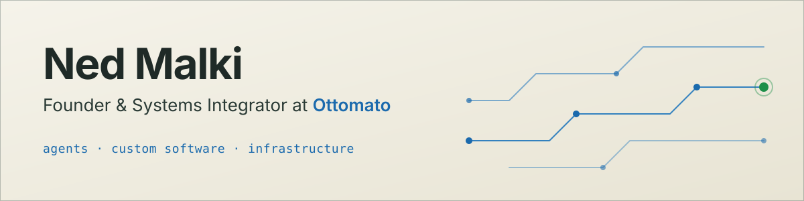

<picture>
  <source media="(prefers-color-scheme: dark)" srcset="assets/banner-dark.svg">
  <source media="(prefers-color-scheme: light)" srcset="assets/banner-light.svg">
  
</picture>

I'm Ned. I run [Ottomato](https://ottomato.ai), where we build AI agents, custom software and the infrastructure underneath them. Businesses come to us for more revenue, a lower cost per task and ROI they can actually measure.

## What I do

Most of my days go into AI agents: qualifying leads, running operations, answering customers and voice. I also build custom software, connect CRMs, ERPs and payment systems, look after hosting and security, and step in as a fractional CTO when a company needs someone to own the architecture.

I write real code for all of it. Python and Node.js, with LangGraph and LangChain for the agents.

## How I work

I work on my clients' accounts, on their hosting, at their pace. That's the approach I try to take every time: you own everything, and I build inside it, not beside it. Before I build anything, I set a baseline, so we can see the ROI in hours and money afterwards.

That's what a forward-deployed engineer does, and it's how I work: I get embedded with the client's hosting and services and set them up and running on their own accounts. Through Ottomato I'm also a Hostinger partner. I don't work for Hostinger, I work for my clients. When one needs hosting, I set it up on an account they own.

## Stack

| Layer | Tools |
| --- | --- |
| Languages | Python, JavaScript (Node.js), TypeScript, PHP, Shell |
| AI and agents | LangGraph, LangChain, Claude Code, MCP |
| Web | Astro, Next.js, React, Tailwind CSS |
| Backend and data | FastAPI, PostgreSQL |
| Cloud and infrastructure | Cloud hosting (Hostinger), Cloudflare, Docker |

## Find me

[ottomato.ai](https://ottomato.ai) · [X @ned_malki](https://x.com/ned_malki)
